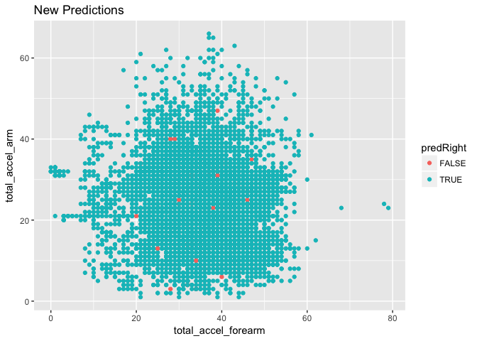

### Loading data and libraries

``` r
library(caret)
library(ggplot2)
library(parallel)
library(doParallel)

training.url    <- 'http://d396qusza40orc.cloudfront.net/predmachlearn/pml-training.csv'
test.url  <- 'http://d396qusza40orc.cloudfront.net/predmachlearn/pml-testing.csv'

download.file(training.url, destfile = "pml-training.csv", method = "curl", quiet = TRUE)
download.file(test.url, destfile = "pml-test.csv", method = "curl",quiet = TRUE)
```

### Transform data. Removing NAs and useless predictors

``` r
##training data
training <- read.csv("pml-training.csv", na.strings = c("NA","#DIV/0!",""))
nas <- apply(training, 2, function(x){any(is.na(x))})
sum(nas) ##100. Only 60 variables have complete data
```

    ## [1] 100

``` r
ok <- training[,!nas]
training <- ok[, -c(1:7)] ##19622x53

##Test data
testing <- read.csv("pml-test.csv", na.strings = c("NA","#DIV/0!",""))
nas <- apply(testing, 2, function(x){any(is.na(x))})
sum(nas) ##100. Only 60 variables have complete data
```

    ## [1] 100

``` r
ok <- testing[,!nas]
testing <- ok[, -c(1:7)] ## 20x53
```

### Building model. Cross validation

``` r
#Split the training data into training and validation set. For reproducibility the seed is set
set.seed(12345)
inTrain <- createDataPartition(training$classe, p=0.6, list = FALSE)
Training <- training[inTrain,]
Validation <- training[-inTrain,]
dim(Training); dim(Validation)
```

    ## [1] 11776    53

    ## [1] 7846   53

### Prediction Model. Machine Learning algorithm-Random Forest

``` r
require(parallel)
require(doParallel)
cl <- makeCluster(detectCores() - 1)
registerDoParallel(cl)
fit <- train(classe~ ., data=Training, method="rf", prox=TRUE)
save(fit, file = "fitmodel.RData")
```

    ## Loading objects:
    ##   fit

Tacking into account that RF are often very accurate, we expect relatively good model performance and a relatively low out of sample error rate:

### Accuracy and Sample Error of the prediction model

``` r
predictTrain <- predict(fit, Training)
confusionMatrix(predictTrain, Training$classe)
```

    ## Confusion Matrix and Statistics
    ## 
    ##           Reference
    ## Prediction    A    B    C    D    E
    ##          A 3348    0    0    0    0
    ##          B    0 2279    0    0    0
    ##          C    0    0 2054    0    0
    ##          D    0    0    0 1930    0
    ##          E    0    0    0    0 2165
    ## 
    ## Overall Statistics
    ##                                      
    ##                Accuracy : 1          
    ##                  95% CI : (0.9997, 1)
    ##     No Information Rate : 0.2843     
    ##     P-Value [Acc > NIR] : < 2.2e-16  
    ##                                      
    ##                   Kappa : 1          
    ##  Mcnemar's Test P-Value : NA         
    ## 
    ## Statistics by Class:
    ## 
    ##                      Class: A Class: B Class: C Class: D Class: E
    ## Sensitivity            1.0000   1.0000   1.0000   1.0000   1.0000
    ## Specificity            1.0000   1.0000   1.0000   1.0000   1.0000
    ## Pos Pred Value         1.0000   1.0000   1.0000   1.0000   1.0000
    ## Neg Pred Value         1.0000   1.0000   1.0000   1.0000   1.0000
    ## Prevalence             0.2843   0.1935   0.1744   0.1639   0.1838
    ## Detection Rate         0.2843   0.1935   0.1744   0.1639   0.1838
    ## Detection Prevalence   0.2843   0.1935   0.1744   0.1639   0.1838
    ## Balanced Accuracy      1.0000   1.0000   1.0000   1.0000   1.0000

### Predicting new values

``` r
predictVal <- predict(fit, Validation)
Validation$predRight <- predictVal == Validation$classe
confusionMatrix(predictVal, Validation$classe)
```

    ## Confusion Matrix and Statistics
    ## 
    ##           Reference
    ## Prediction    A    B    C    D    E
    ##          A 2227   10    0    0    0
    ##          B    5 1503    6    0    2
    ##          C    0    5 1358   18    3
    ##          D    0    0    4 1266    5
    ##          E    0    0    0    2 1432
    ## 
    ## Overall Statistics
    ##                                           
    ##                Accuracy : 0.9924          
    ##                  95% CI : (0.9902, 0.9942)
    ##     No Information Rate : 0.2845          
    ##     P-Value [Acc > NIR] : < 2.2e-16       
    ##                                           
    ##                   Kappa : 0.9903          
    ##  Mcnemar's Test P-Value : NA              
    ## 
    ## Statistics by Class:
    ## 
    ##                      Class: A Class: B Class: C Class: D Class: E
    ## Sensitivity            0.9978   0.9901   0.9927   0.9844   0.9931
    ## Specificity            0.9982   0.9979   0.9960   0.9986   0.9997
    ## Pos Pred Value         0.9955   0.9914   0.9812   0.9929   0.9986
    ## Neg Pred Value         0.9991   0.9976   0.9985   0.9970   0.9984
    ## Prevalence             0.2845   0.1935   0.1744   0.1639   0.1838
    ## Detection Rate         0.2838   0.1916   0.1731   0.1614   0.1825
    ## Detection Prevalence   0.2851   0.1932   0.1764   0.1625   0.1828
    ## Balanced Accuracy      0.9980   0.9940   0.9943   0.9915   0.9964

From the training subset, the accuracy is very high at 1 with 0.95% out-of-bag (OOB) error rate. When applied to the validation set for cross validation, the model achieved an accuracy of 99.2% and the out of sample error is 0.008.

``` r
print(fit)
```

    ## Random Forest 
    ## 
    ## 11776 samples
    ##    52 predictor
    ##     5 classes: 'A', 'B', 'C', 'D', 'E' 
    ## 
    ## No pre-processing
    ## Resampling: Bootstrapped (25 reps) 
    ## Summary of sample sizes: 11776, 11776, 11776, 11776, 11776, 11776, ... 
    ## Resampling results across tuning parameters:
    ## 
    ##   mtry  Accuracy   Kappa    
    ##    2    0.9844638  0.9803465
    ##   27    0.9859593  0.9822385
    ##   52    0.9799910  0.9746875
    ## 
    ## Accuracy was used to select the optimal model using  the largest value.
    ## The final value used for the model was mtry = 27.

The expected out of the sample error is 0.014. (1 - 0.986 = 0.014).

Exploring how well predictions perform

``` r
qplot(total_accel_forearm, total_accel_arm, colour=predRight, data=Validation, main="New Predictions")
```



``` r
#length(which(Validation$predRight==FALSE)) ##60
```

Given the high level of accuracy, there is no need to build more complicate prediction models making the interpretation harder. Out of 7846 only 60 were predicted wrong.

### Apply machine learning algorithm to the 20 test cases

``` r
#apply random forest model to test set
predTesting <- predict(fit, testing)
predTesting
```

    ##  [1] B A B A A E D B A A B C B A E E A B B B
    ## Levels: A B C D E
